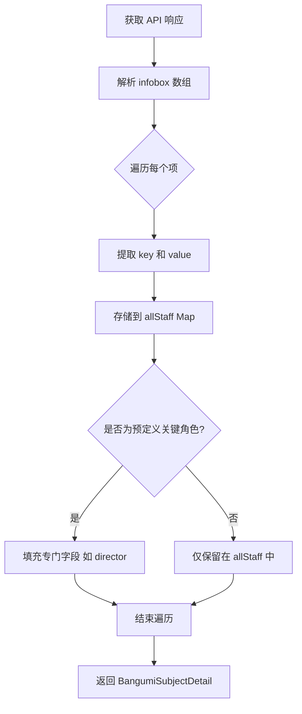

# 修复 Bangumi 制作人员解析逻辑方案

## 1. 现状分析
目前应用通过 `BangumiSubjectDetail.fromJson` 解析 Bangumi API 返回的 `infobox` 数据。问题在于：
- **硬编码键名匹配**：目前仅支持少数硬编码的键名（如“导演”、“脚本”）。
- **字段缺失**：许多重要的角色（如“原作”、“人物设定”、“音乐”等）没有被捕获。
- **解析逻辑局限**：`_parseInfobox` 遇到匹配的键后立即返回第一个值，忽略了其他可能重要的信息。

## 2. 改进方案

### 2.1 模型层 (`lib/models/bangumi_models.dart`)
- **引入通用 Staff 存储**：在 `BangumiSubjectDetail` 中增加一个 `Map<String, String> allStaff` 字段，用于存储所有从 `infobox` 中提取的键值对。
- **保留快捷访问字段**：继续保留 `director`, `script` 等字段以兼容现有 UI 和 Notion 导出，但其解析将基于更鲁棒的匹配规则。
- **增强 `_parseInfobox`**：支持更广泛的模糊匹配或直接提取所有 infobox 项。

### 2.2 UI 层 (`lib/screens/detail_page.dart`)
- **动态展示制作人员**：在“制作人员”板块中，不再使用硬编码的列表，而是遍历 `allStaff` 字典进行展示。

### 2.3 Notion 导出层 (`lib/services/notion_api.dart`)
- **增强导出逻辑**：如果用户配置了特定的映射，则使用映射；否则，可以考虑将所有制作人员汇总到一个“制作人员”富文本属性中。

## 3. 实施步骤

1.  **修改 `BangumiSubjectDetail`**：
    - 添加 `Map<String, String> infoboxMap` 成员。
    - 在 `fromJson` 中遍历整个 `infobox` 列表，将其转化为 `Map`。
    - 更新 `director` 等字段的解析方式，直接从 `infoboxMap` 获取。

2.  **更新 `_buildInfoGrid` 在 `DetailPage` 中**：
    - 改为遍历 `detail.infoboxMap`。

3.  **更新 Notion 导出**：
    - 确保新提取的信息能正确同步。

## 4. Mermaid 流程图 (解析逻辑)

## 5. 待确认事项
- [ ] 是否需要过滤掉某些非制作人员的 infobox 信息（如“别名”、“发售日”等，因为应用已有专门字段处理）。
- [ ] Notion 导出时，如果字段过多是否会触发长度限制。
